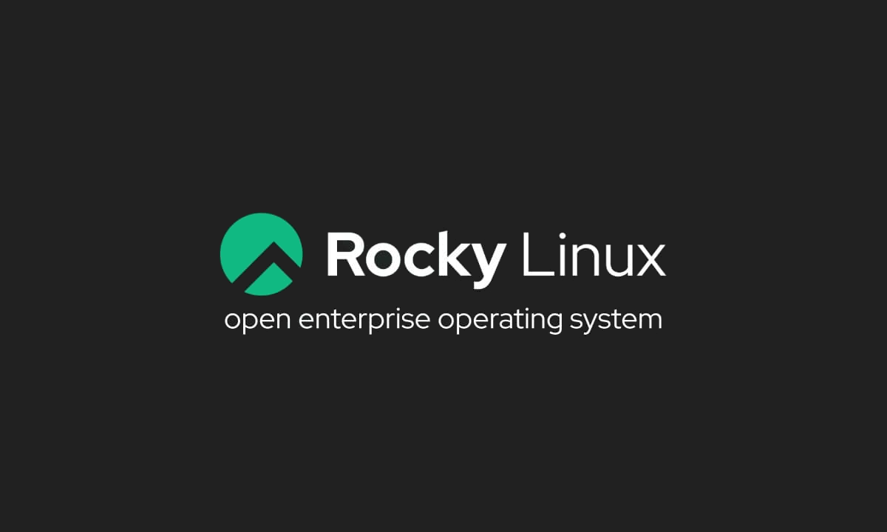

# Instalacion de paquetes

Vamos a instalar paquetes .rpm, para esto usaremos el gestor de paquentes DNF tambien es posible usar YUM, pero como mencione DNF es una versión mejorada del YUM asi que usaremos DNF, pero su uso es identico habria que reemplazar dnf en los comandos a continuacion por yum.

---
a) Actualizar el sistema:
```
sudo dnf update
#Este comando actualizará todos los paquetes instalados en el sistema a sus versiones más recientes disponibles.
```
b) Buscar paquetes:
```
sudo dnf search (paquete)
#Este comando te mostrará información sobre los paquetes disponibles que coinciden con el término de búsqueda.
```
c) Instalar algún paquete:
```
sudo dnf install nombre-del-paquete
#Este comando descargará e instalará el paquete junto con sus dependencias.
```
d) Comprobar que se ha instalado:
```
rpm -q nombre-del-paquete
#Esto mostrará el estado del paquete en el sistema.
```
e) Desinstalar el paquete:
```
sudo dnf remove nombre-del-paquete
#Este comando eliminará el paquete y, si es necesario, también sus dependencias no utilizadas
```
<iframe width="560" height="315" src="https://youtu.be/O830XG6_ORI" frameborder="0" allowfullscreen></iframe>

[](https://youtu.be/O830XG6_ORI)
